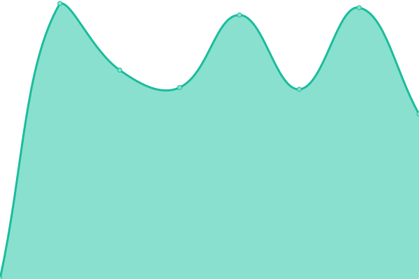
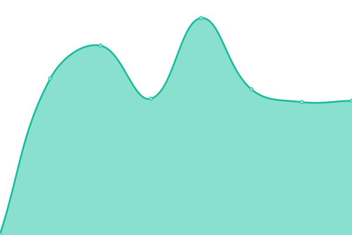

# [📈 Live Status](https://shelwong.github.io/benqservers): <!--live status--> **🟧 Partial outage**

This repository contains the open-source uptime monitor and status page for [shelwong](https://shelwong.github.io/benqservers), powered by [Upptime](https://github.com/upptime/upptime).

With [Upptime](https://upptime.js.org), you can get your own unlimited and free uptime monitor and status page, powered entirely by a GitHub repository. We use [Issues](https://github.com/shelwong/benqservers/issues) as incident reports, [Actions](https://github.com/shelwong/benqservers/actions) as uptime monitors, and [Pages](https://shelwong.github.io/benqservers) for the status page.

<!--start: status pages-->
<!-- This summary is generated by Upptime (https://github.com/upptime/upptime) -->
<!-- Do not edit this manually, your changes will be overwritten -->
<!-- prettier-ignore -->
| URL | Status | History | Response Time | Uptime |
| --- | ------ | ------- | ------------- | ------ |
|  [BenQ AMS](https://ams.benq.com/#/) | 🟩 Up | [ben-q-ams.yml](https://github.com/BQA-FAE/benqservers/commits/HEAD/history/ben-q-ams.yml) | 

 494ms
     
 | 

<a href="https://BQA-FAE.github.io/benqservers/history/ben-q-ams">100.00%</a>
    

|  [BenQ IAM](https://iam.benq.com/) | 🟩 Up | [ben-q-iam.yml](https://github.com/BQA-FAE/benqservers/commits/HEAD/history/ben-q-iam.yml) | 

 748ms
     
 | 

<a href="https://BQA-FAE.github.io/benqservers/history/ben-q-iam">100.00%</a>
    

|  [BenQ DMS](https://dms.benq.com/#/) | 🟩 Up | [ben-q-dms.yml](https://github.com/BQA-FAE/benqservers/commits/HEAD/history/ben-q-dms.yml) | 

 466ms
     
 | 

<a href="https://BQA-FAE.github.io/benqservers/history/ben-q-dms">100.00%</a>
    

|  [BenQ X-Sign Broadcast](https://x-signbroadcast.benq.com/) | 🟩 Up | [ben-q-x-sign-broadcast.yml](https://github.com/BQA-FAE/benqservers/commits/HEAD/history/ben-q-x-sign-broadcast.yml) | 

 618ms
     
 | 

<a href="https://BQA-FAE.github.io/benqservers/history/ben-q-x-sign-broadcast">100.00%</a>
    

|  [BenQ Service Portal](https://service-portal.benq.com/) | 🟩 Up | [ben-q-service-portal.yml](https://github.com/BQA-FAE/benqservers/commits/HEAD/history/ben-q-service-portal.yml) | 

 739ms
     
 | 

<a href="https://BQA-FAE.github.io/benqservers/history/ben-q-service-portal">100.00%</a>
    

|  [EZWrite IoT](https://ezwriteupload-eu.s3.eu-central-1.amazonaws.com/) | 🟥 Down | [ez-write-io-t.yml](https://github.com/BQA-FAE/benqservers/commits/HEAD/history/ez-write-io-t.yml) | 

 0ms
     
 | 

<a href="https://BQA-FAE.github.io/benqservers/history/ez-write-io-t">0.19%</a>
    

|  [EZWrite Cognito](https://cognito-identity.eu-central-1.amazonaws.com/) | 🟥 Down | [ez-write-cognito.yml](https://github.com/BQA-FAE/benqservers/commits/HEAD/history/ez-write-cognito.yml) | 

 0ms
     
 | 

<a href="https://BQA-FAE.github.io/benqservers/history/ez-write-cognito">0.09%</a>
    

|  [EZWrite S3](https://benq-ezwrite-eu.s3.eu-central-1.amazonaws.com) | 🟥 Down | [ez-write-s3.yml](https://github.com/BQA-FAE/benqservers/commits/HEAD/history/ez-write-s3.yml) | 

 0ms
     
 | 

<a href="https://BQA-FAE.github.io/benqservers/history/ez-write-s3">0.00%</a>
    

|  [EZWrite SNS](https://sns.eu-central-1.amazonaws.com) | 🟥 Down | [ez-write-sns.yml](https://github.com/BQA-FAE/benqservers/commits/HEAD/history/ez-write-sns.yml) | 

 0ms
     
 | 

<a href="https://BQA-FAE.github.io/benqservers/history/ez-write-sns">0.00%</a>
    

|  [EZWrite SQS](https://sqs.eu-central-1.amazonaws.com) | 🟥 Down | [ez-write-sqs.yml](https://github.com/BQA-FAE/benqservers/commits/HEAD/history/ez-write-sqs.yml) | 

 0ms
     
 | 

<a href="https://BQA-FAE.github.io/benqservers/history/ez-write-sqs">0.11%</a>
    

|  [EZWrite Portal](https://ezwrite6.benq.com) | 🟥 Down | [ez-write-portal.yml](https://github.com/BQA-FAE/benqservers/commits/HEAD/history/ez-write-portal.yml) | 

 0ms
     
 | 

<a href="https://BQA-FAE.github.io/benqservers/history/ez-write-portal">0.00%</a>
    

|  [EZW6 API](https://ezwrite6-api.benq.com) | 🟥 Down | [ezw-6-api.yml](https://github.com/BQA-FAE/benqservers/commits/HEAD/history/ezw-6-api.yml) | 

 0ms
     
 | 

<a href="https://BQA-FAE.github.io/benqservers/history/ezw-6-api">0.00%</a>
    

|  [EZ5 API](https://ezwrite.benq.com) | 🟥 Down | [ez-5-api.yml](https://github.com/BQA-FAE/benqservers/commits/HEAD/history/ez-5-api.yml) | 

 0ms
     
 | 

<a href="https://BQA-FAE.github.io/benqservers/history/ez-5-api">0.05%</a>
    

|  [Matomo](https://matomo.benq.com) | 🟥 Down | [matomo.yml](https://github.com/BQA-FAE/benqservers/commits/HEAD/history/matomo.yml) | 

 0ms
     
 | 

<a href="https://BQA-FAE.github.io/benqservers/history/matomo">0.03%</a>
    

|  [EZ5/EZ6 apk OTA URL](https://d2fqxlpnusiysx.cloudfront.net) | 🟥 Down | [ez-5-ez-6-apk-ota-url.yml](https://github.com/BQA-FAE/benqservers/commits/HEAD/history/ez-5-ez-6-apk-ota-url.yml) | 

 0ms
     
 | 

<a href="https://BQA-FAE.github.io/benqservers/history/ez-5-ez-6-apk-ota-url">0.15%</a>
    

|  [EZ5 QR Code Sharin](https://ezwriteupload.s3-ap-northeast-1.amazonaws.com) | 🟥 Down | [ez-5-qr-code-sharin.yml](https://github.com/BQA-FAE/benqservers/commits/HEAD/history/ez-5-qr-code-sharin.yml) | 

 0ms
     
 | 

<a href="https://BQA-FAE.github.io/benqservers/history/ez-5-qr-code-sharin">0.25%</a>
    

|  [EZ5 Collab Server](https://ezwrite-relay.benq.com/) | 🟥 Down | [ez-5-collab-server.yml](https://github.com/BQA-FAE/benqservers/commits/HEAD/history/ez-5-collab-server.yml) | 

 0ms
     
 | 

<a href="https://BQA-FAE.github.io/benqservers/history/ez-5-collab-server">0.00%</a>
    

|  [EZWrite APK Download Server](http://qspublic.s3.amazonaws.com) | 🟥 Down | [ez-write-apk-download-server.yml](https://github.com/BQA-FAE/benqservers/commits/HEAD/history/ez-write-apk-download-server.yml) | 

 0ms
     
 | 

<a href="https://BQA-FAE.github.io/benqservers/history/ez-write-apk-download-server">0.00%</a>
    

|  [EZWrite APK Download Server 2](http://qspublic.s3.ap-southeast-1.amazonaws.com) | 🟥 Down | [ez-write-apk-download-server-2.yml](https://github.com/BQA-FAE/benqservers/commits/HEAD/history/ez-write-apk-download-server-2.yml) | 

 0ms
     
 | 

<a href="https://BQA-FAE.github.io/benqservers/history/ez-write-apk-download-server-2">0.00%</a>
    

|  [EZWrite OTA File Server](https://qspublic.s3-ap-southeast-1.amazonaws.com/) | 🟥 Down | [ez-write-ota-file-server.yml](https://github.com/BQA-FAE/benqservers/commits/HEAD/history/ez-write-ota-file-server.yml) | 

 0ms
     
 | 

<a href="https://BQA-FAE.github.io/benqservers/history/ez-write-ota-file-server">0.03%</a>
    

|  [BenQ FW API Server](http://vod.benq.com/tvservice_api/api/response.php) | 🟥 Down | [ben-q-fw-api-server.yml](https://github.com/BQA-FAE/benqservers/commits/HEAD/history/ben-q-fw-api-server.yml) | 

 0ms
     
 | 

<a href="https://BQA-FAE.github.io/benqservers/history/ben-q-fw-api-server">0.00%</a>
    

|  [FW OTA Image Server](https://d3bx1fc1zkxy8q.cloudfront.net) | 🟥 Down | [fw-ota-image-server.yml](https://github.com/BQA-FAE/benqservers/commits/HEAD/history/fw-ota-image-server.yml) | 

 0ms
     
 | 

<a href="https://BQA-FAE.github.io/benqservers/history/fw-ota-image-server">0.00%</a>
    

|  [FW OTA Update .XML](https://donglefw.s3-ap-northeast-1.amazonaws.com/) | 🟥 Down | [fw-ota-update-xml.yml](https://github.com/BQA-FAE/benqservers/commits/HEAD/history/fw-ota-update-xml.yml) | 

 0ms
     
 | 

<a href="https://BQA-FAE.github.io/benqservers/history/fw-ota-update-xml">0.13%</a>
    

|  [FW QOTA API Server](https://qotaapi.benq.com/api/v2/) | 🟥 Down | [fw-qota-api-server.yml](https://github.com/BQA-FAE/benqservers/commits/HEAD/history/fw-qota-api-server.yml) | 

 0ms
     
 | 

<a href="https://BQA-FAE.github.io/benqservers/history/fw-qota-api-server">0.00%</a>
    

|  [FW Self-update API Server](https://vod.benq.com) | 🟥 Down | [fw-self-update-api-server.yml](https://github.com/BQA-FAE/benqservers/commits/HEAD/history/fw-self-update-api-server.yml) | 

 0ms
     
 | 

<a href="https://BQA-FAE.github.io/benqservers/history/fw-self-update-api-server">0.00%</a>
    

|  [Firebase API Server](https://benqqota.firebaseio.com) | 🟥 Down | [firebase-api-server.yml](https://github.com/BQA-FAE/benqservers/commits/HEAD/history/firebase-api-server.yml) | 

 0ms
     
 | 

<a href="https://BQA-FAE.github.io/benqservers/history/firebase-api-server">0.00%</a>
    

|  [OTA Pkg and Release note](https://d1m7bten765ify.cloudfront.net) | 🟥 Down | [ota-pkg-and-release-note.yml](https://github.com/BQA-FAE/benqservers/commits/HEAD/history/ota-pkg-and-release-note.yml) | 

 0ms
     
 | 

<a href="https://BQA-FAE.github.io/benqservers/history/ota-pkg-and-release-note">0.00%</a>
    

|  [AMS API](https://ams.benq.com/api/*) | 🟥 Down | [ams-api.yml](https://github.com/BQA-FAE/benqservers/commits/HEAD/history/ams-api.yml) | 

 0ms
     
 | 

<a href="https://BQA-FAE.github.io/benqservers/history/ams-api">0.02%</a>
    

|  [Dropbox API](https://api.dropboxapi.com) | 🟥 Down | [dropbox-api.yml](https://github.com/BQA-FAE/benqservers/commits/HEAD/history/dropbox-api.yml) | 

 0ms
     
 | 

<a href="https://BQA-FAE.github.io/benqservers/history/dropbox-api">0.05%</a>
    

|  [Register InstaQShare](http://h1.ee-share.com/+B19B2:B38) | 🟥 Down | [register-insta-q-share.yml](https://github.com/BQA-FAE/benqservers/commits/HEAD/history/register-insta-q-share.yml) | 

 0ms
     
 | 

<a href="https://BQA-FAE.github.io/benqservers/history/register-insta-q-share">0.00%</a>
    

|  [Load BenQ Suggest](http://vod.benq.com/suggest/public/) | 🟥 Down | [load-ben-q-suggest.yml](https://github.com/BQA-FAE/benqservers/commits/HEAD/history/load-ben-q-suggest.yml) | 

 0ms
     
 | 

<a href="https://BQA-FAE.github.io/benqservers/history/load-ben-q-suggest">0.15%</a>
    

|  [Easy WW API Server](https://smartdms.benq.com/ESApi/public) | 🟥 Down | [easy-ww-api-server.yml](https://github.com/BQA-FAE/benqservers/commits/HEAD/history/easy-ww-api-server.yml) | 

 0ms
     
 | 

<a href="https://BQA-FAE.github.io/benqservers/history/easy-ww-api-server">0.18%</a>
    

|  [Easy WW Relay Server](http://relaysmartdms.benq.com:443) | 🟥 Down | [easy-ww-relay-server.yml](https://github.com/BQA-FAE/benqservers/commits/HEAD/history/easy-ww-relay-server.yml) | 

 0ms
     
 | 

<a href="https://BQA-FAE.github.io/benqservers/history/easy-ww-relay-server">0.27%</a>
    

|  [Easy CN API Server](https://smartdms.benq.com.cn/ESApi/public) | 🟥 Down | [easy-cn-api-server.yml](https://github.com/BQA-FAE/benqservers/commits/HEAD/history/easy-cn-api-server.yml) | 

 0ms
     
 | 

<a href="https://BQA-FAE.github.io/benqservers/history/easy-cn-api-server">0.00%</a>
    

|  [Easy CN Relay Server](http://relaysmartdms.benq.com.cn:443) | 🟥 Down | [easy-cn-relay-server.yml](https://github.com/BQA-FAE/benqservers/commits/HEAD/history/easy-cn-relay-server.yml) | 

 0ms
     
 | 

<a href="https://BQA-FAE.github.io/benqservers/history/easy-cn-relay-server">0.00%</a>
    

|  [WW X-sign Cloud Server (maintaining connection)](https://Relay.benq.com) | 🟥 Down | [ww-x-sign-cloud-server-maintaining-connection.yml](https://github.com/BQA-FAE/benqservers/commits/HEAD/history/ww-x-sign-cloud-server-maintaining-connection.yml) | 

 0ms
     
 | 

<a href="https://BQA-FAE.github.io/benqservers/history/ww-x-sign-cloud-server-maintaining-connection">0.01%</a>
    

|  [WW X-sign Cloud Server (API Service)](https://Apiservice.benq.com) | 🟥 Down | [ww-x-sign-cloud-server-api-service.yml](https://github.com/BQA-FAE/benqservers/commits/HEAD/history/ww-x-sign-cloud-server-api-service.yml) | 

 0ms
     
 | 

<a href="https://BQA-FAE.github.io/benqservers/history/ww-x-sign-cloud-server-api-service">0.00%</a>
    

|  [WW X-sign Cloud Server (Manager connection)](https://X-Sign.benq.com) | 🟥 Down | [ww-x-sign-cloud-server-manager-connection.yml](https://github.com/BQA-FAE/benqservers/commits/HEAD/history/ww-x-sign-cloud-server-manager-connection.yml) | 

 0ms
     
 | 

<a href="https://BQA-FAE.github.io/benqservers/history/ww-x-sign-cloud-server-manager-connection">0.00%</a>
    

|  [WW X-sign Cloud Server (Player Logs)](https://logapiservice.benq.com) | 🟥 Down | [ww-x-sign-cloud-server-player-logs.yml](https://github.com/BQA-FAE/benqservers/commits/HEAD/history/ww-x-sign-cloud-server-player-logs.yml) | 

 0ms
     
 | 

<a href="https://BQA-FAE.github.io/benqservers/history/ww-x-sign-cloud-server-player-logs">0.00%</a>
    

|  [WW X-sign Cloud Server (BDP/Archive)](https://xsignbdp-eu.s3.eu-central-1.amazonaws.com) | 🟥 Down | [ww-x-sign-cloud-server-bdp-archive.yml](https://github.com/BQA-FAE/benqservers/commits/HEAD/history/ww-x-sign-cloud-server-bdp-archive.yml) | 

 0ms
     
 | 

<a href="https://BQA-FAE.github.io/benqservers/history/ww-x-sign-cloud-server-bdp-archive">0.00%</a>
    

|  [WW X-sign Cloud Server (Get Weather)](https://sa900-api.elasticbeanstalk.com) | 🟥 Down | [ww-x-sign-cloud-server-get-weather.yml](https://github.com/BQA-FAE/benqservers/commits/HEAD/history/ww-x-sign-cloud-server-get-weather.yml) | 

 0ms
     
 | 

<a href="https://BQA-FAE.github.io/benqservers/history/ww-x-sign-cloud-server-get-weather">0.00%</a>
    

|  [Openweather](https://api.openweathermap.org) | 🟥 Down | [openweather.yml](https://github.com/BQA-FAE/benqservers/commits/HEAD/history/openweather.yml) | 

 0ms
     
 | 

<a href="https://BQA-FAE.github.io/benqservers/history/openweather">0.00%</a>
    

|  [Get Device JSON (DMS Cloud)](http://staging2.benq.com) | 🟥 Down | [get-device-json-dms-cloud.yml](https://github.com/BQA-FAE/benqservers/commits/HEAD/history/get-device-json-dms-cloud.yml) | 

 0ms
     
 | 

<a href="https://BQA-FAE.github.io/benqservers/history/get-device-json-dms-cloud">0.00%</a>
    

|  [DMS MQTT Connection](https://dms-relay.benq.com) | 🟥 Down | [dms-mqtt-connection.yml](https://github.com/BQA-FAE/benqservers/commits/HEAD/history/dms-mqtt-connection.yml) | 

 0ms
     
 | 

<a href="https://BQA-FAE.github.io/benqservers/history/dms-mqtt-connection">0.44%</a>
    

|  [MDA Command Data (DMS Cloud & Local) 1](https://cmota.s3.amazonaws.com) | 🟥 Down | [mda-command-data-dms-cloud-and-local-1.yml](https://github.com/BQA-FAE/benqservers/commits/HEAD/history/mda-command-data-dms-cloud-and-local-1.yml) | 

 0ms
     
 | 

<a href="https://BQA-FAE.github.io/benqservers/history/mda-command-data-dms-cloud-and-local-1">0.57%</a>
    

|  [MDA Command Data (DMS Cloud & Local) 2](https://cmota.s3.ap-northeast-1.amazonaws.com) | 🟥 Down | [mda-command-data-dms-cloud-and-local-2.yml](https://github.com/BQA-FAE/benqservers/commits/HEAD/history/mda-command-data-dms-cloud-and-local-2.yml) | 

 0ms
     
 | 

<a href="https://BQA-FAE.github.io/benqservers/history/mda-command-data-dms-cloud-and-local-2">0.00%</a>
    

|  [Verify/Release Key (DMS Local)](https://dsdownload.benq.com) | 🟥 Down | [verify-release-key-dms-local.yml](https://github.com/BQA-FAE/benqservers/commits/HEAD/history/verify-release-key-dms-local.yml) | 

 0ms
     
 | 

<a href="https://BQA-FAE.github.io/benqservers/history/verify-release-key-dms-local">0.00%</a>
    

|  [AWS IoT Service for MQTT (DMS Cloud)](apexd90h2t5wg-ats.iot.eu-central-1.amazonaws.com) | 🟩 Up | [aws-io-t-service-for-mqtt-dms-cloud.yml](https://github.com/BQA-FAE/benqservers/commits/HEAD/history/aws-io-t-service-for-mqtt-dms-cloud.yml) | 

 98ms
     
 | 

<a href="https://BQA-FAE.github.io/benqservers/history/aws-io-t-service-for-mqtt-dms-cloud">100.00%</a>
    

|  [AWS IoT Service for MQTT (DMS Local)](apexd90h2t5wg-ats.iot.eu-central-1.amazonaws.com) | 🟩 Up | [aws-io-t-service-for-mqtt-dms-local.yml](https://github.com/BQA-FAE/benqservers/commits/HEAD/history/aws-io-t-service-for-mqtt-dms-local.yml) | 

 92ms
     
 | 

<a href="https://BQA-FAE.github.io/benqservers/history/aws-io-t-service-for-mqtt-dms-local">100.00%</a>
    

|  [DMS Firewall](https://benq-dms-eu.s3.eu-central-1.amazonaws.com) | 🟥 Down | [dms-firewall.yml](https://github.com/BQA-FAE/benqservers/commits/HEAD/history/dms-firewall.yml) | 

 0ms
     
 | 

<a href="https://BQA-FAE.github.io/benqservers/history/dms-firewall">0.00%</a>
    

<!--end: status pages-->

[**Visit our status website →**](https://bqa-fae.github.io/benqservers)

## 📄 License

- Powered by: [Upptime](https://github.com/upptime/upptime)
- Code: [MIT](./LICENSE) © [shelwong](https://shelwong.github.io/benqservers)
- Data in the `./history` directory: [Open Database License](https://opendatacommons.org/licenses/odbl/1-0/)
